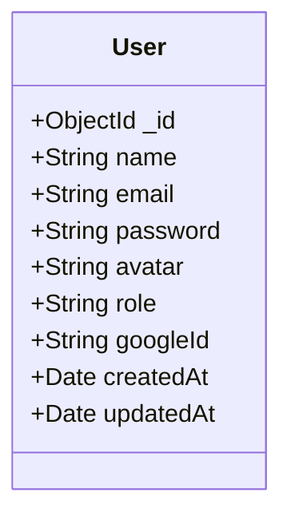
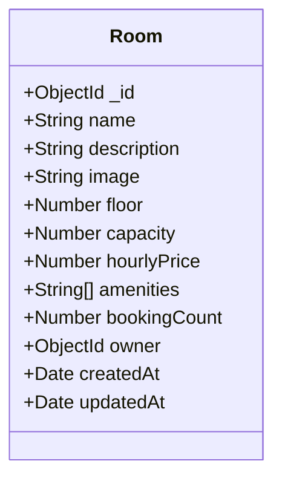
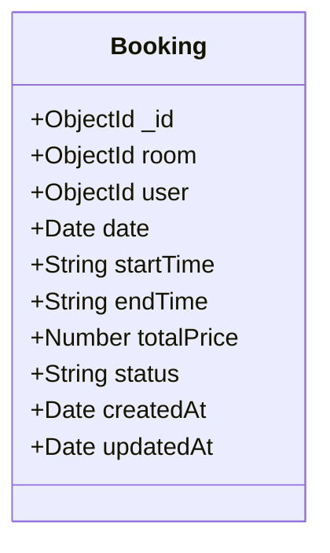

# StudyNook Database Models and Schemas

This document provides a detailed breakdown of the MongoDB document structures and relationships defined under `src/models/*`.

---

## 1. User Model (`src/models/User.js`)
Stores authentication credentials, user profiles, and authority levels.

*   **`name`**: String, required, trimmed.
*   **`email`**: String, required, unique, lowercase, trimmed. Used for credential sign-in.
*   **`password`**: String, minimum length 6. Optional if the user signs up via Google OAuth.
*   **`avatar`**: String, defaults to empty. Stores Google profile picture URLs or customized upload URLs.
*   **`role`**: String, enum `["user", "admin"]`, default `"user"`.
*   **`googleId`**: String, unique, sparse. Populated only when the user logs in via Better Auth Google OAuth.

---

## 2. Room Model (`src/models/Room.js`)
Represents the study rooms available for booking.

*   **`name`**: String, required, trimmed.
*   **`description`**: String, required.
*   **`image`**: String, required.
*   **`floor`**: Number, required, minimum value 1.
*   **`capacity`**: Number, required, minimum value 1.
*   **`hourlyPrice`**: Number, required, minimum value 0.
*   **`amenities`**: Array of Strings. Enforced to match pre-approved categories:
    `WiFi`, `Projector`, `Whiteboard`, `Power Outlets`, `Air Conditioning`, `Natural Light`, `Coffee Machine`, `Sound System`, `Printer`, `Meeting Display`.
*   **`bookingCount`**: Number, defaults to 0. Incremented automatically whenever a booking is created.
*   **`owner`**: Mongoose `ObjectId` referencing the `User` collection. Required.

---

## 3. Booking Model (`src/models/Booking.js`)
Manages study room reservation schedules.

*   **`room`**: Mongoose `ObjectId` referencing the `Room` collection. Required.
*   **`user`**: Mongoose `ObjectId` referencing the `User` collection. Required.
*   **`date`**: Date object, normalized to midnight (00:00:00:000) for comparisons. Required.
*   **`startTime`**: String, required. Matches 24-hour clock regex `/^([01]\d|2[0-3]):[0-5]\d$/` (e.g. `"09:30"`).
*   **`endTime`**: String, required. Matches 24-hour clock regex `/^([01]\d|2[0-3]):[0-5]\d$/` (e.g. `"11:00"`).
*   **`totalPrice`**: Number, required. Calculated dynamically: `(endTime - startTime) * Room.hourlyPrice`.
*   **`status`**: String, enum `["confirmed", "cancelled"]`, default `"confirmed"`.
